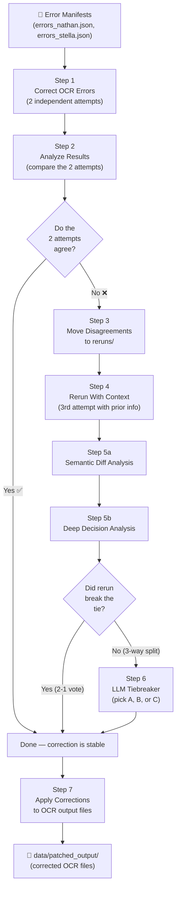

# OCR Error Correction Pipeline

This pipeline corrects OCR (Optical Character Recognition) errors in digitized handwritten historical documents. It sends each flagged error to an LLM (Large Language Model) along with cropped images of the original handwriting, asks whether the OCR text matches the handwriting, and collects the corrected text.

The pipeline runs multiple passes and uses voting to ensure reliable corrections.

---

## How It Works (Overview)



---

## Pipeline Steps

| Step | Script | What It Does |
|------|--------|-------------|
| 1 | `step1_correct_ocr_errors.py` | Sends each error to the LLM with cropped handwriting images. Run twice (via `step1_run_both_attempts.py`) to get two independent opinions. |
| 2 | `step2_analyze_results.py` | Compares the two attempts. Produces CSVs showing agreement rates, convergence analysis, and per-error breakdowns. |
| 3 | `step3_move_disagreements.py` | Copies error folders where the two attempts disagreed into `data/reruns/` for re-processing. |
| 4 | `step4_rerun_with_context.py` | Re-processes disagreements with enhanced context (includes what prior attempts concluded). Adds a `semantic_difference` field. |
| 5a | `step5a_analyze_semantic_diffs.py` | Computes string similarity between corrected_line variants. Flags whether differences are meaningful (word changes) or trivial (whitespace). |
| 5b | `step5b_deep_decision_analysis.py` | Determines whether the rerun broke the tie (2-1 vote) or created a three-way split. |
| 6 | `step6_resolve_three_way_splits.py` | For three-way splits: sends all 3 options + images to the LLM and asks it to pick the best transcription. |
| 7 | `step7_apply_corrections.py` | Collects all fix results, votes on the best correction per line, and patches the OCR output files. |

---

## Shared Modules

| File | Purpose |
|------|---------|
| `prompts.py` | System prompt and error-type-specific hints sent to the LLM |
| `image_helpers.py` | PDF rendering, image cropping, and base64 encoding |
| `cost_tracker.py` | Tracks API usage (tokens, cost) across all pipeline steps |
| `.env.example` | Template showing all required environment variables |

---

## Utility Scripts

| Script | Purpose |
|--------|---------|
| `util_check_collisions.py` | Verifies no two errors from different source files map to the same output path |
| `util_collect_error_types.py` | Lists all unique error types across manifest files |
| `util_rename_old_files.py` | Renames old-format filenames to include the source name prefix |
| `util_test_image_crops.py` | Quick visual test — crops the first N errors' images and saves them |

---

## Setup

### 1. Python Environment

```bash
python -m venv venv
venv\Scripts\activate        # Windows
# source venv/bin/activate   # macOS/Linux

pip install openai python-dotenv pymupdf pillow pydantic
# Optional (for step 5a embedding analysis):
# pip install sentence-transformers torch
```

### 2. Environment Variables

Copy `.env.example` to `.env` and fill in your Azure OpenAI credentials:

```bash
cp .env.example .env
```

You need 5 Azure OpenAI endpoints (for round-robin load balancing). Each needs:
- `AZURE_OPENAI_ENDPOINT_N` — the endpoint URL
- `AZURE_OPENAI_KEY_N` — the API key

### 3. Data Directory

The pipeline expects a `data/` folder with this structure:

```
data/
├── errors_nathan.json          # Error manifest (Nathan's low-confidence errors)
├── errors_stella.json          # Error manifest (Stella's pattern-based errors)
├── pdf-pages/                  # Single-page PDFs for each document page
│   ├── volume-1/
│   │   ├── volume-1-page-1.pdf
│   │   ├── volume-1-page-2.pdf
│   │   └── ...
│   └── ...
├── output/                     # Original OCR output (layout.json + read.json per page)
│   ├── volume-1/
│   │   ├── page-1/
│   │   │   ├── layout.json
│   │   │   └── read.json
│   │   └── ...
│   └── ...
├── corrected_files/            # Step 1 output (created by the pipeline)
├── reruns/                     # Step 3-6 output (created by the pipeline)
├── metadata/                   # Progress/failure tracking (created by the pipeline)
└── patched_output/             # Step 7 output — the final corrected OCR files
```

See [data/README.md](data/README.md) for more details on the data directory.

---

## Running the Pipeline

Run these steps in order:

```bash
# Step 1: Run correction twice (sets ATTEMPT_NUMBER=1 then 2)
python step1_run_both_attempts.py

# Step 2: Analyze agreement between the two attempts
python step2_analyze_results.py

# Step 3: Move disagreements to reruns/
python step3_move_disagreements.py

# Step 4: Rerun disagreements with enhanced context
# (set ATTEMPT_NUMBER=3 in .env first)
python step4_rerun_with_context.py

# Step 5a: Analyze semantic diffs among variants
python step5a_analyze_semantic_diffs.py

# Step 5b: Deep decision analysis (tie broken or three-way split?)
python step5b_deep_decision_analysis.py

# Step 6: Resolve three-way splits via LLM tiebreaker
python step6_resolve_three_way_splits.py

# Step 7: Apply corrections to OCR output
python step7_apply_corrections.py
```

### Dry Run Mode

Steps 3, 6, and 7 support `--dry-run` to preview changes without writing files:

```bash
python step7_apply_corrections.py --dry-run
```

### Report-Only Mode

Step 7 supports `--report` to generate CSVs without patching files:

```bash
python step7_apply_corrections.py --report
```

---

## How the LLM Correction Works

For each flagged error, the pipeline:

1. **Renders the PDF page** at configurable DPI
2. **Crops two images**: the full line context + the specific flagged token
3. **Sends both images** to the LLM along with the OCR text and error type hint
4. **Asks the LLM**: "Does the OCR text match the handwriting? If not, what should it say?"
5. **Validates the response** against a strict JSON schema
6. **Saves the result** as a fix file alongside the original error metadata

The LLM response includes:
- `needs_correction` — whether the OCR text is wrong
- `needs_error_correction` — whether the flagged token specifically is wrong
- `needs_context_correction` — whether surrounding context needs fixing
- `corrected_line` — the corrected text (or "NULL" if no correction needed)

---

## Error Types

The pipeline handles 12+ error types, each with a tailored hint in the prompt:

- `low_confidence` — OCR had low confidence on this token
- `hyphenated_word` — potential hyphenation error
- `small_token` — very short token that might be misread
- `hotword_general`, `hotword_abbreviations`, `hotword_numbers`, etc.
- `ellipsis_2`, `ellipsis_3` — dot sequences
- `quote_straight` — straight vs curly quote detection
- `equals_sign` — equals sign that might be a dash

See `prompts.py` for the full list of hints.

---

## Key Design Decisions

- **Flat file structure** — all scripts in one folder, no nested packages. Simple imports, no `sys.path` hacks.
- **Fail fast** — if something goes wrong, the error is logged and the script continues to the next error. No silent swallowing.
- **Round-robin client pool** — 5 Azure OpenAI endpoints are cycled through to spread the load.
- **Voting for consensus** — multiple attempts vote on the best correction. Majority wins. If no majority, the line is flagged for review.
- **Conservative by default** — when in doubt, the pipeline prefers not to change the OCR text.
